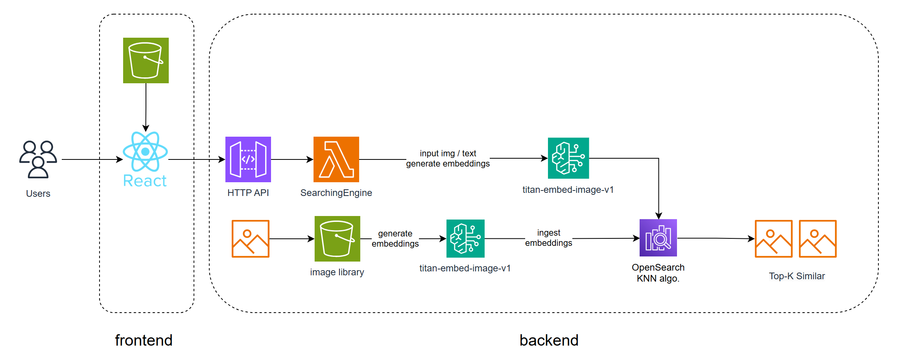

# 20250307 AWS Generative AI Hackathon Warm-up Workshop
demo for workshop on 250307 @awseducatestdambtw

## Key Concepts
- [ ] Multi-Modal Foundation Model
- [ ] Opensearch serverless

## Introduction
This project integrates multimodal model technology and utilizes the generative AI capabilities of Amazon Bedrock to create a web application. Users can obtain recommended images through the following methods:

1. **Text Search**: Enter keywords to retrieve relevant images.
2. **Image Search**: Upload an image to find similar ones.

The system retrieves image data from OpenSearch based on user input and provides personalized recommendations, creating an image exploration experience similar to Pinterest.

## Key Technologies and Services

### **1. Amazon Bedrock**
- Uses `amazon.titan-embed-image-v1` for embedding images and text to enhance search accuracy.

### **2. OpenSearch**
- Creates an index to store and retrieve image tags and descriptions.
- Provides high-performance full-text and vector-based search.

### **3. Amazon S3**
- Stores static frontend pages and image data.
- Supplies image URLs for OpenSearch indexing.

### **4. AWS Lambda & API Gateway**
- Connects the AI chatbot backend.
- Provides API services for frontend interaction with OpenSearch.

## Features Overview

- **Keyword Search**: Retrieves images based on tags and descriptions via OpenSearch.
- **Image Similarity Search**: Uses Amazon Bedrock embedding models to match similar images.
- **Personalized Recommendations**: Provides personalized image suggestions based on user search history and interactions.

## Deployment and Usage

### **Prerequisites**
- AWS services must be enabled (Bedrock, OpenSearch, S3, Lambda, API Gateway).
- Sufficient IAM permissions to manage the mentioned AWS services.

### **Deployment Steps**
1. **Set Up OpenSearch Index**
   - Configure image tags and description fields.
   - Upload initial image data.

2. **Configure Amazon S3**
   - Upload images and static frontend files.
   - Allow OpenSearch to access image URLs.

3. **Set Up Amazon Bedrock**
   - Enable `amazon.titan-embed-image-v1` model.
   - Create an API endpoint for Lambda integration.

4. **Deploy Lambda and API Gateway**
   - Create a Lambda function to handle search requests.
   - Expose API via API Gateway for frontend access.

## Image gallery references
- pixabay
- kaggle